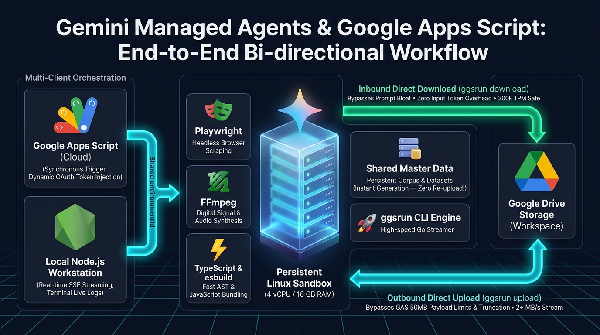

# Taking Advantage of Gemini Managed Agents with Google Apps Script

[](LICENSE)
[](https://developers.google.com/apps-script)
[](https://ai.google.dev/gemini-api/docs/agents)
[](https://github.com/tanaikech/ggsrun)

<p align="center">
  
</p>

This repository provides an enterprise-grade architecture that bridges **Google Apps Script (GAS)** with **Gemini Managed Agents** (Gemini v1beta Interactions and Environments API) to execute high-performance, native Linux workloads.

By combining persistent remote Linux sandboxes (4 vCPU, 16 GB RAM) with dynamic Google OAuth access token injection and bi-directional cloud-to-cloud streaming via [ggsrun](https://github.com/tanaikech/ggsrun), developers can transcend traditional Apps Script platform limitations while bypassing API payload limits, memory bottlenecks, and conversational token quotas.

---

## Key Features

- **Break Free from GAS Platform Limits**: Execute native Linux tools directly from Google Apps Script, including headless browser automation ([Playwright](https://playwright.dev/)), audio synthesis & digital signal processing ([FFmpeg](https://ffmpeg.org/)), and high-speed TypeScript compilation ([esbuild](https://esbuild.github.io/)).
- **Bi-directional Cloud-to-Cloud Streaming**:
  - **Outbound (Direct Upload)**: Stream multi-megabyte binary deliverables directly from the sandbox to Google Drive via `ggsrun upload`, bypassing GAS's 50 MB URL Fetch payload limit and stdout buffer truncation.
  - **Inbound (Direct Download)**: Stream large external datasets directly from Google Drive into the sandbox via `ggsrun download`, eliminating prompt data embedding to minimize input token consumption and protect the 200,000 TPM rate quota.
- **Shared Persistent Sandbox**: Stage common master datasets and pre-installed toolchains inside the sandbox filesystem (`/workspace/`) and share a single `environmentId` across Google Apps Script, local Node.js environments, and CI/CD pipelines to eliminate redundant data re-upload overhead.
- **Dynamic OAuth Token Injection**: Dynamically inject fresh Google OAuth access tokens (`ScriptApp.getOAuthToken()` in GAS, `gcloud auth print-access-token` locally) per execution turn, resolving 1-hour token expiration limits while maintaining airtight workspace authentication.
- **Dual-Client Orchestration (Cloud & Local)**: Control the exact same persistent container from Google Apps Script for automated cloud workflows and from Node.js with Server-Sent Events (SSE) streaming for real-time local debugging.
- **Empirically Proven 2x Acceleration**: Validated via benchmarks that direct CLI cloud-to-cloud streaming is **1.98x faster** than API Base64 retrieval with zero local GAS CPU overhead and zero memory footprint.

---

## Repository Structure

```text
managed-agents-gas/
├── gas-src/                                # Google Apps Script source code
│   ├── ManagedAgentSandboxClient.js       # Core client managing sandbox lifecycle & session persistence
│   ├── tests.js                           # Master test suite (Tests 1–6, provisioning, teardown)
│   └── execution-logs.md                  # Complete execution logs and transcripts for GAS tests
├── local-node.js-src/                     # Local Node.js Server-Sent Events (SSE) streaming runner
│   ├── ManagedAgentSandboxStreamClient.js # SSE streaming client with ANSI real-time console rendering
│   ├── testSuites.js                      # Local test suite runner (Tests 1–6 and teardown)
│   ├── package.json                       # Node.js dependencies (@google/genai, dotenv, etc.)
│   ├── README.md                          # Local runner quickstart and documentation
│   └── execution-logs.md                  # Live SSE streaming execution logs
├── appsscript.json                        # Apps Script manifest with required OAuth scopes
└── README.md                              # Main documentation (this file)
```

---

## Prerequisites

1. **Gemini API Key**: Obtain an API key from [Google AI Studio](https://ai.google.dev/gemini-api/docs/api-key).
2. **Google Drive Destination Folder**: A designated Google Drive folder to store generated deliverables.
3. **ggsrun CLI**: The Go CLI tool [ggsrun](https://github.com/tanaikech/ggsrun) is automatically downloaded and configured inside the sandbox container during provisioning.

---

## Usage: Google Apps Script (Cloud)

### 1. Project Setup

1. Create a new Google Apps Script project at [script.google.com](https://script.google.com) (or open a container-bound script from Google Sheets/Docs).
2. Copy and paste the following files into your Apps Script editor:
   - [`gas-src/ManagedAgentSandboxClient.js`](gas-src/ManagedAgentSandboxClient.js)
   - [`gas-src/tests.js`](gas-src/tests.js)
3. Open **Project Settings** > **Script Properties** and add:
   - `GEMINI_API_KEY`: _Your Gemini API Key_
4. Ensure your `appsscript.json` manifest includes the necessary OAuth scopes:
   ```json
   {
     "oauthScopes": [
       "https://www.googleapis.com/auth/script.external_request",
       "https://www.googleapis.com/auth/drive"
     ]
   }
   ```

### 2. Execution Guide

Open [`gas-src/tests.js`](gas-src/tests.js) in the Apps Script editor and run the target functions from the dropdown menu:

| Function Name | Description | Script Link | Execution Log Link |
| :--- | :--- | :--- | :--- |
| `provisionSharedSandbox()` | Boots 4 vCPU / 16 GB RAM container, installs toolchains, and saves `environmentId` to `PropertiesService`. | [`gas-src/tests.js`](gas-src/tests.js#L36-L92) | [`gas-src/execution-logs.md`](gas-src/execution-logs.md#1-provisioning-unified-linux-sandbox) |
| `runTest1_UserAgentComparison()` | Verifies raw POSIX socket transmission and custom HTTP `User-Agent` retention. | [`gas-src/tests.js`](gas-src/tests.js#L129-L212) | [`gas-src/execution-logs.md`](gas-src/execution-logs.md#2-test-1-user-agent-customization--posix-socket-verification) |
| `runTest2_GgsrunDirectDeployment()` | Tests dynamic OAuth token injection and Google Drive direct file access via `ggsrun`. | [`gas-src/tests.js`](gas-src/tests.js#L214-L266) | [`gas-src/execution-logs.md`](gas-src/execution-logs.md#3-test-2-ggsrun-deployment--drive-direct-access-verification) |
| `runTest3_PlaywrightDirectUpload()` | Executes headless Chromium scraping and bulk-uploads screenshots & JSON to Drive. | [`gas-src/tests.js`](gas-src/tests.js#L268-L377) | [`gas-src/execution-logs.md`](gas-src/execution-logs.md#4-test-3-playwright-headless-scraping-to-direct-drive-upload) |
| `runTest4_FFmpegAudioDirectUpload()` | Synthesizes multi-tone audio chords via FFmpeg/SoX and uploads MP3 & waveform JSON. | [`gas-src/tests.js`](gas-src/tests.js#L379-L437) | [`gas-src/execution-logs.md`](gas-src/execution-logs.md#5-test-4-ffmpeg-audio-synthesis--transcoding-to-direct-drive-upload) |
| `runTest5_TypeScriptASTDirectUpload()` | Parses TypeScript AST schemas and bundles code via `esbuild` (13 ms build). | [`gas-src/tests.js`](gas-src/tests.js#L439-L540) | [`gas-src/execution-logs.md`](gas-src/execution-logs.md#6-test-5-typescript-ast-extraction--esbuild-bundling-to-direct-drive-upload) |
| `runTest6_DriveUploadPerformanceComparison()` | Evaluates 10 KB binary transfer: Direct `ggsrun` streaming vs. API Base64 transfer. | [`gas-src/tests.js`](gas-src/tests.js#L542-L728) | [`gas-src/execution-logs.md`](gas-src/execution-logs.md#7-test-6-performance-benchmark-direct-ggsrun-upload-vs-base64-via-gas) |
| `testListSandboxes()` | Queries the Environments API to list active sandboxes and metadata. | [`gas-src/tests.js`](gas-src/tests.js#L109-L127) | [`gas-src/execution-logs.md`](gas-src/execution-logs.md#1-provisioning-unified-linux-sandbox) |
| `teardownSharedSandbox()` | Releases remote container resources and clears `PropertiesService`. | [`gas-src/tests.js`](gas-src/tests.js#L94-L107) | — |

---

## Usage: Local Workstation (Node.js SSE Stream Runner)

The local test runner connects to the exact same remote Linux sandbox using Server-Sent Events (SSE) streaming powered by the `@google/genai` SDK.

### 1. Setup

```bash
cd local-node.js-src
npm install
cp .env.example .env
```

Configure your `.env` file:
```ini
GEMINI_API_KEY=your_gemini_api_key_here
ENVIRONMENT_ID=environments/env-xxxxxxxxxxxx   # From GAS provisioning
TARGET_FOLDER_ID=your_google_drive_folder_id_here
```

### 2. Execution Guide

| Command | Description | Script Link | Execution Log Link |
| :--- | :--- | :--- | :--- |
| `npm test` | Runs all 6 tests sequentially with live terminal streaming. | [`local-node.js-src/testSuites.js`](local-node.js-src/testSuites.js) | [`local-node.js-src/execution-logs.md`](local-node.js-src/execution-logs.md) |
| `npm run test:1` | Runs Test 1 (User-Agent & POSIX socket verification). | [`local-node.js-src/testSuites.js`](local-node.js-src/testSuites.js#L135-L200) | [`local-node.js-src/execution-logs.md`](local-node.js-src/execution-logs.md#test-1-user-agent-customization--posix-socket-verification) |
| `npm run test:2` | Runs Test 2 (ggsrun direct Google Drive verification). | [`local-node.js-src/testSuites.js`](local-node.js-src/testSuites.js#L202-L244) | [`local-node.js-src/execution-logs.md`](local-node.js-src/execution-logs.md#test-2-ggsrun-deployment--drive-direct-access-verification) |
| `npm run test:3` | Runs Test 3 (Playwright headless scraping & Drive upload). | [`local-node.js-src/testSuites.js`](local-node.js-src/testSuites.js#L246-L340) | [`local-node.js-src/execution-logs.md`](local-node.js-src/execution-logs.md#test-3-playwright-headless-scraping-to-direct-drive-upload) |
| `npm run test:4` | Runs Test 4 (FFmpeg audio synthesis & Drive upload). | [`local-node.js-src/testSuites.js`](local-node.js-src/testSuites.js#L342-L387) | [`local-node.js-src/execution-logs.md`](local-node.js-src/execution-logs.md#test-4-ffmpeg-audio-synthesis--transcoding-to-direct-drive-upload) |
| `npm run test:5` | Runs Test 5 (TypeScript AST extraction & esbuild bundle). | [`local-node.js-src/testSuites.js`](local-node.js-src/testSuites.js#L389-L472) | [`local-node.js-src/execution-logs.md`](local-node.js-src/execution-logs.md#test-5-typescript-ast-extraction--esbuild-bundling-to-direct-drive-upload) |
| `npm run test:6` | Runs Test 6 (10 KB transfer performance benchmark). | [`local-node.js-src/testSuites.js`](local-node.js-src/testSuites.js#L474-L579) | [`local-node.js-src/execution-logs.md`](local-node.js-src/execution-logs.md#test-6-performance-benchmark-direct-ggsrun-upload-vs-base64-via-gas) |
| `npm run test:teardown` | Safely purges and deletes the remote sandbox environment. | [`local-node.js-src/testSuites.js`](local-node.js-src/testSuites.js#L116-L133) | — |

---

## Test Suites & Benchmark Summary

```text
================================================================================
PERFORMANCE BENCHMARK: 10,000 BYTES FILE TRANSFER TO GOOGLE DRIVE
================================================================================
| Metric                       | Approach A: Direct ggsrun Upload | Approach B: Base64 via Gemini API -> GAS |
| :--------------------------- | :------------------------------- | :--------------------------------------- |
| Transfer Method              | Direct Sandbox-to-Drive (Go CLI) | Base64 Stream -> GAS -> Drive            |
| Drive File Name              | benchmark_10kb_ggsrun.bin        | benchmark_10kb_gas.bin                   |
| Verified File Size           | 10,000 bytes (9.77 KB)           | 10,000 bytes (9.77 KB)                   |
| API Turns Required           | 1 Turn (Direct Offload)          | 1 Turn (Base64 Retrieval)                |
| Local GAS Processing Time    | 0.00 s (Zero CPU overhead)       | 1.23 s (Base64 Decode & Blob Creation)   |
| Total End-to-End Duration    | 16.20 s                          | 32.13 s                                  |
| Effective Throughput         | 0.60 KB/s                        | 0.30 KB/s                                |
| Performance Multiplier       | 1.98x FASTER                     | Baseline (Higher Latency & Token Usage)  |
================================================================================
```

---

## References

- [Gemini API Managed Agents Documentation](https://ai.google.dev/gemini-api/docs/agents)
- [Gemini API Rate Limits & Quotas](https://ai.google.dev/gemini-api/docs/rate-limits)
- [ggsrun: Go CLI for Google Apps Script & Google Drive](https://github.com/tanaikech/ggsrun)
- [Google Apps Script Quotas & Limits](https://developers.google.com/apps-script/guides/services/quotas)
- [Martin Hawksey: Exploring Gemini Managed Agents and the Google Workspace CLI](https://pulse.appsscript.info/p/2026/08/adding-a-spark-of-intelligence-to-google-workspace-exploring-gemini-managed-agents-and-the-google-workspace-cli/)

---

## Licence

[MIT](LICENSE)

## Author

[Kanshi Tanaike](https://github.com/tanaikech)
